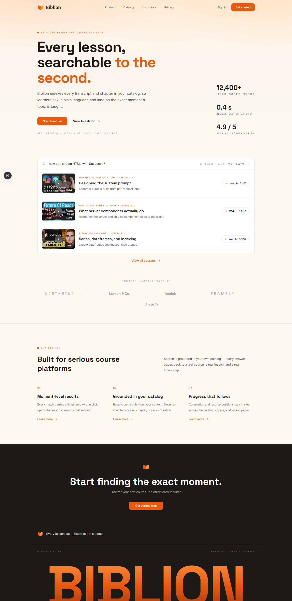
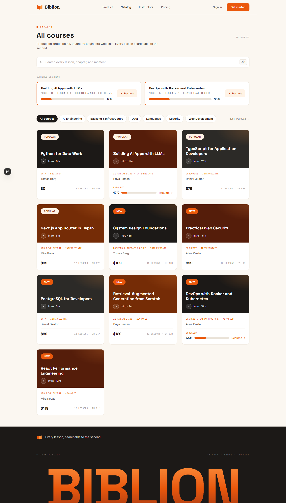
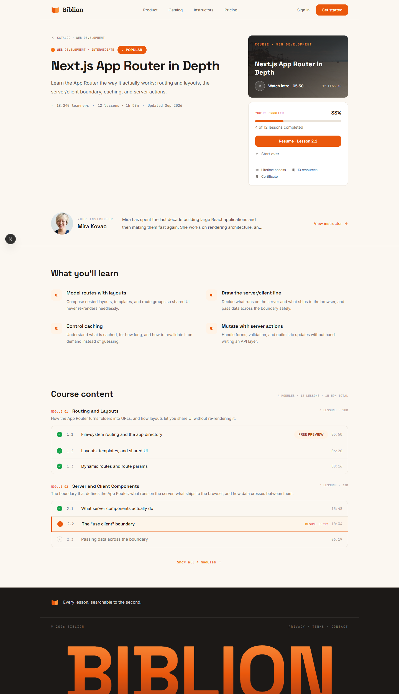
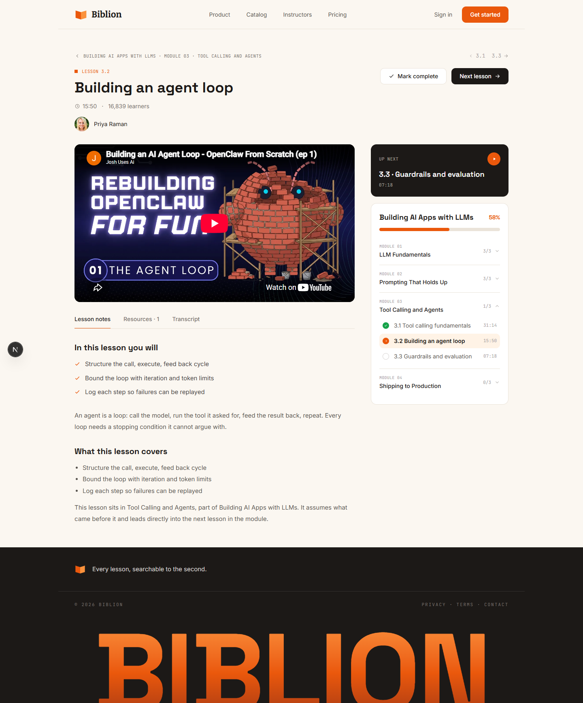
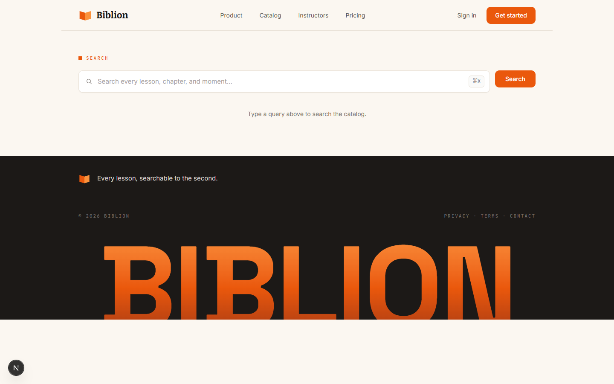

<div align="center">



# Biblion

**Every lesson, searchable to the second.**

An AI-powered learning platform where a plain-language search doesn't just find a course — it finds the *exact second* in a video where a topic is taught, and plays it from there.

[](https://nextjs.org)
[](https://www.typescriptlang.org)
[](https://www.sanity.io)
[](https://clerk.com)
[](https://groq.com)
[](https://posthog.com)

</div>

---

## What is this

Biblion is a full-stack course marketplace: a catalog, course and lesson pages, real video playback, learner progress, and an **intelligent search agent** that reasons over the actual content — chapters, transcripts, lesson notes — and returns grounded, clickable results instead of a chatbot reply.

Built end-to-end with **agentic AI** (Claude Code), driven by a single [`AGENTS.md`](./AGENTS.md) file instead of one giant prompt, plus a set of dedicated skills for the trickier pieces (wiring an LLM to a live content database, tuning what it's allowed to know, shaping how it talks back). See [`prompts/`](./prompts) for the full paper trail of every feature's design decisions, investigation notes, and trade-offs — nothing here was a black box.

## Screenshots

| Home | Catalog |
|---|---|
|  |  |

| Course | Lesson (real video playback) |
|---|---|
|  |  |

| Search |
|---|
|  |

## Features

- **Catalog & course pages** — real courses, modules, lessons, instructors, and categories, all authored in Sanity.
- **Real video playback** — every lesson embeds its actual YouTube/Vimeo/Bunny video via the provider's own player (never a custom one). Playback can seek to any second via a URL param.
- **Intelligent search** — a Groq-powered agent connected to the [Sanity Context MCP](https://www.sanity.io/docs) searches lesson content and video transcripts, then returns structured, ranked results (never conversational prose).
  - **Two-stage timestamp resolution**: chapter markers are matched first (clean, authored table-of-contents entries); transcript text is only a fallback.
  - **Grounded by construction**: the LLM only ever proposes a `lessonId` and a `matchedSecond`. The server re-fetches the real lesson and verifies the timestamp against that video's real chapter/transcript data before anything reaches the screen — an invented lesson or timestamp is silently dropped, never displayed.
  - Result cards deep-link straight to `/lessons/[slug]?start=607`; the lesson page passes that second to the embed, which seeks there on load.
- **Offline video ingestion pipeline** — parses chapter markers out of source video descriptions into timestamped Sanity documents, decoupled from the request path.
- **Auth** — Clerk, gating only what needs it; browsing stays public.
- **Product analytics** — PostHog events for search performed, result opened, video played, watch depth, resume used, and lesson completed — captured server-side where the action is server-side.
- **Full SEO layer** — per-page metadata, Open Graph/Twitter cards, a generated favicon and OG image, `robots.txt`, and a real `sitemap.xml`.

## Tech stack

| Layer | Choice |
|---|---|
| Framework | [Next.js 16](https://nextjs.org) (App Router), TypeScript, Tailwind v4 |
| CMS | [Sanity](https://www.sanity.io) (standalone Studio, `next-sanity`, Portable Text) |
| Auth | [Clerk](https://clerk.com) |
| Search | [Vercel AI SDK](https://sdk.vercel.ai) + [Groq](https://groq.com) + the Sanity Context MCP |
| Analytics | [PostHog](https://posthog.com) |
| Video | YouTube / Vimeo / Bunny embeds (provider-native players only) |

## Project structure

```
app/                  Next.js routes — catalog, course/lesson pages, search, auth, API
components/           UI components, organized by feature area (search, lesson, catalog, course, ui)
lib/                  Server-side helpers: search agent, video provider, analytics, plain-text utils
sanity/               Server-only Sanity client, image builder, GROQ queries
studio/               Standalone Sanity Studio workspace (schema, content authoring)
scripts/              Offline tooling (video ingestion pipeline)
prompts/              One file per feature: goal, investigation, decisions, acceptance criteria
docs/screenshots/     README assets
AGENTS.md             The project's shared brain — read by every agent before any change
```

## Content model

| Type | What it holds |
|---|---|
| `course` | Title, summary, cover image, level, price, learning outcomes, an ordered list of modules |
| `lesson` | Title, video URL, poster, duration, key points, Portable Text notes, resources |
| `video` | One per unique video URL — chapters (table of contents) and transcript chunks, both timestamped |
| `instructor` / `category` | Author and taxonomy content, each with their own display page |

A lesson doesn't store its parent course — it's derived via a reverse reference, kept out of the model to avoid duplication.

## Getting started

**Prerequisites**: Node.js 20+, a [Sanity](https://www.sanity.io) project, a [Clerk](https://clerk.com) app, a [Groq](https://console.groq.com) API key (free tier), a [PostHog](https://posthog.com) project.

```bash
# 1. Install dependencies (web + studio are separate workspaces)
npm install
cd studio && npm install && cd ..

# 2. Configure environment
cp .env.example .env.local
# fill in Clerk keys, Sanity project id/dataset/read token, Groq key —
# see .env.example for what each one does. Also add PostHog's project
# token/host (NEXT_PUBLIC_POSTHOG_PROJECT_TOKEN, NEXT_PUBLIC_POSTHOG_HOST) —
# required by the app, not yet listed in .env.example.

# 3. Deploy the Studio (required — the Context MCP only serves datasets
# with a deployed Studio application)
cd studio && npx sanity deploy && cd ..

# 4. Run the app
npm run dev
```

Open [http://localhost:3000](http://localhost:3000). Sanity Studio itself runs separately via `cd studio && npm run dev`.

### Ingesting video chapters

```bash
node scripts/ingest-videos.mjs
```

Reads `seed/videos.json`, pulls chapter markers out of each video's real description, and writes `video` documents keyed by a sanitized provider video ID. Transcript chunks are supported in the schema but not currently populated (see [`prompts/video-ingestion.md`](./prompts/video-ingestion.md) for why).

## How this was built

Every feature in this repo started as a written prompt in [`prompts/`](./prompts) — goal, what was investigated, the decisions made and why, security considerations, and acceptance criteria — reviewed before a line of code was written. [`AGENTS.md`](./AGENTS.md) is the persistent contract every agent reads first: the tech stack, the architectural boundaries (read-only pages, a server-only Sanity client, search that's grounded and never invents data), and the workflow itself.

A few of the harder problems documented in `prompts/`, if you want the real story instead of the highlight reel:

- **`search.md`** — three LLM providers in production before one actually fit a free tier's rate limits, including a live debugging session against Groq's real token-per-minute budget.
- **`tune-search-context-and-prompt.md`** — verifying every claim in the search agent's instructions against the live dataset (some had quietly gone stale), and finding a real gap where those instructions had stopped reaching the model at all.
- **`video-ingestion.md`** — why transcript scraping across four different approaches turned out to be infeasible, and the decision to ship chapters-only rather than fake it.

## Known limitations

- Learner progress (completion, resume position) is currently derived/mock data for display — there's no persisted per-user progress backend yet.
- Video transcript chunks are schema-ready but empty; only chapter-level search currently returns video moments.
- The search agent runs on Groq's free tier, which has both per-minute and per-day token caps — expect occasional rate-limit waits under heavy testing.

## License

Personal/portfolio project — not currently licensed for reuse.
